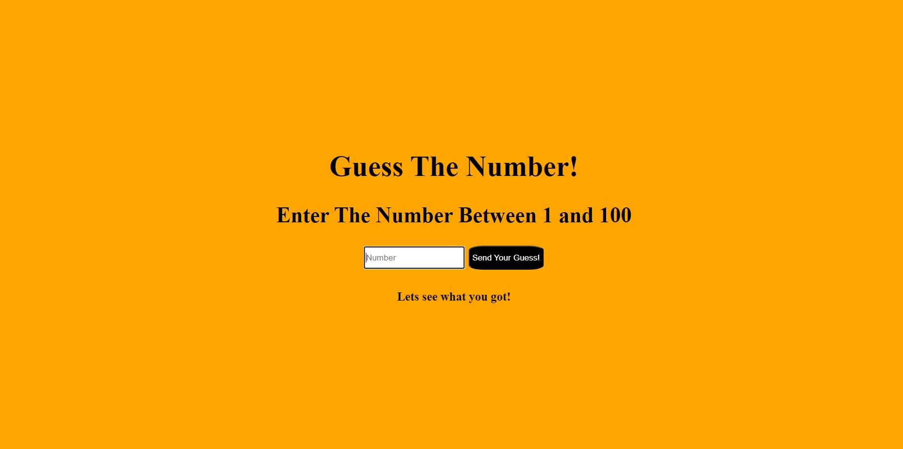

# Guess-The-Number

<b>15/08/2022</b>
 

Here is my 6th project. In this project, I created Number Guessing Game. With this project, I've learned how to build a game by using **HTML & CSS, Javascript** features.
With the features that I would learn, I will build more spesific and detailed websites. Step by step, to achieving my goals.

Here you can see the project output:
