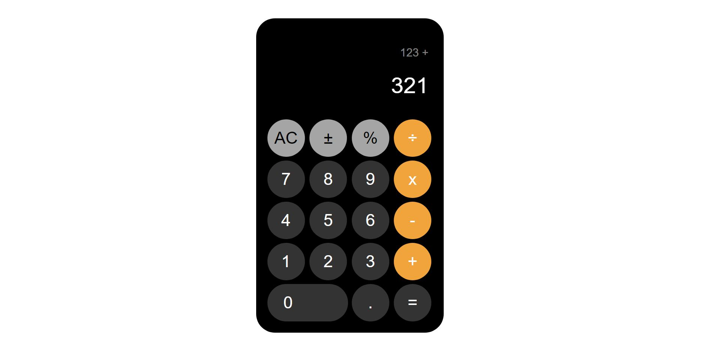

# IOS Calculator

<b>19/08/2022</b>
 

Here is my 8th project. In this project, I re-created IOS Calculator.With this project, I've learned how to build a calculator by using **HTML & CSS, Javascript** features. You can do calculations by using mathematical operators. I've added hover effect for more realistic view. As an option, we can also add scientific operators for more detailed calculator.

With the features that I would learn, I will build more spesific and detailed websites and applications. Step by step, to achieving my goals.

Here you can see the project output:
