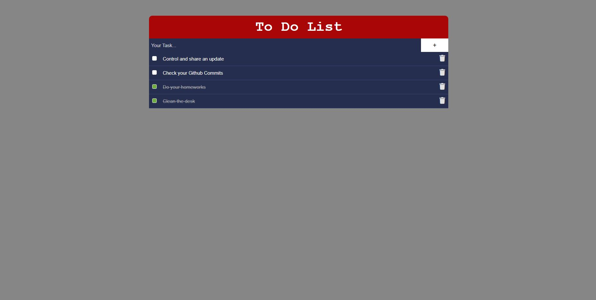

# To-Do-Application

<b>17/08/2022</b>
 

Here is my 7th project. In this project, I created To Do Application. With this project, I've learned how to build an application by using **HTML & CSS, Javascript** features. You can add or delete task. Also you can select the task that is completed.
With the features that I would learn, I will build more spesific and detailed websites and applications. Step by step, to achieving my goals.

Here you can see the project output:
